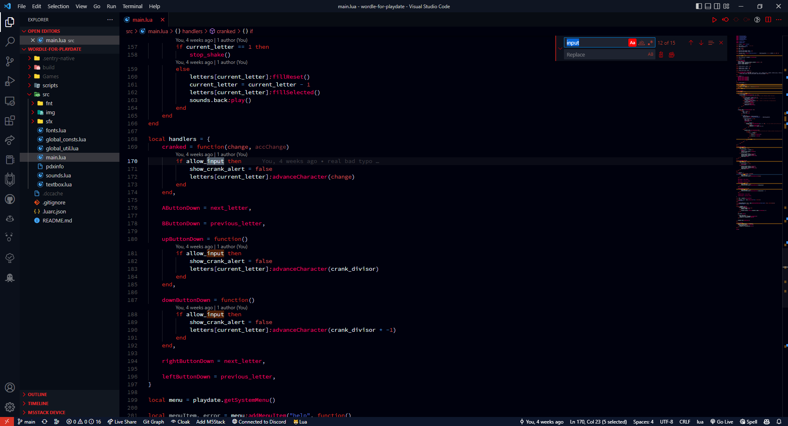
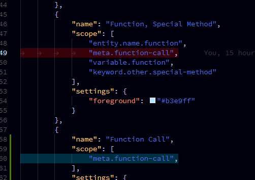
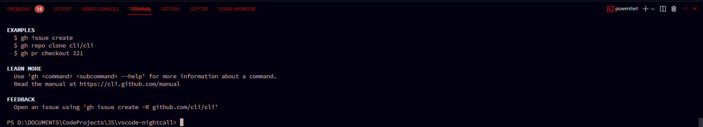
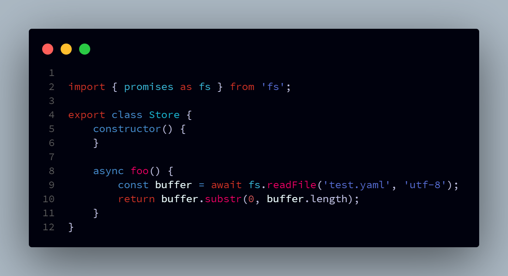
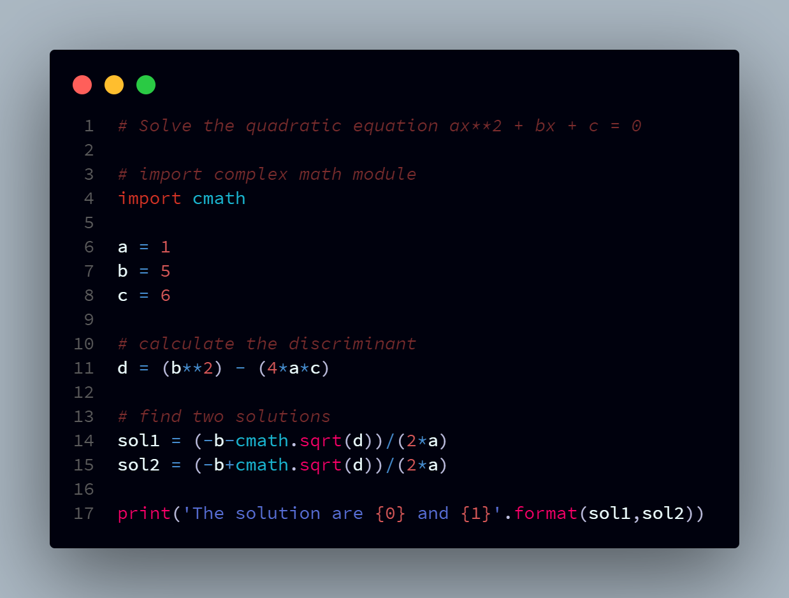
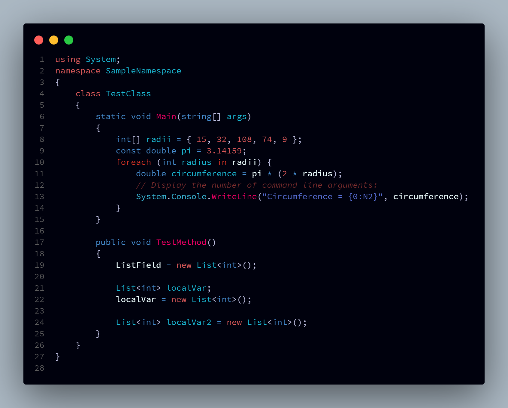
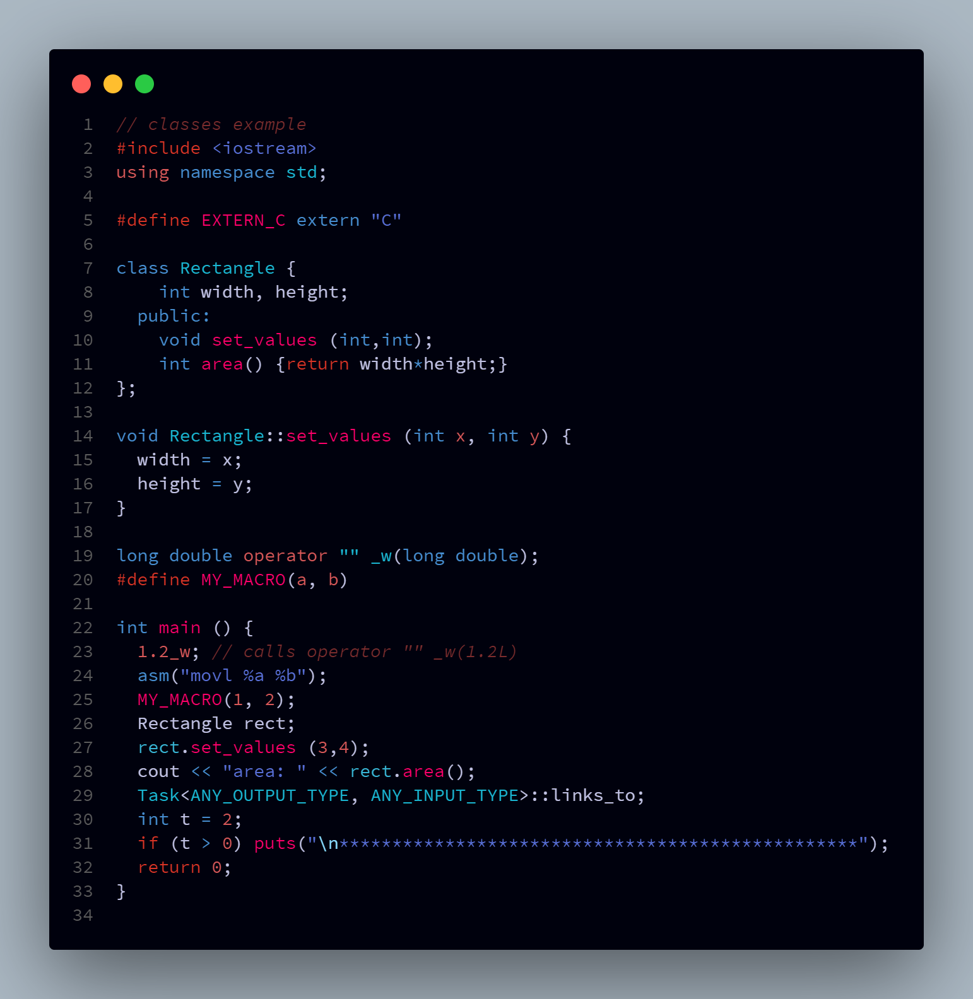
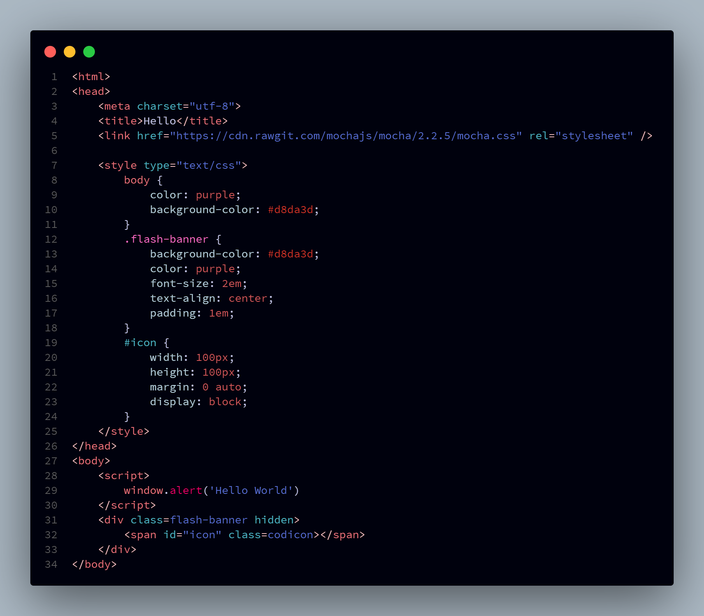
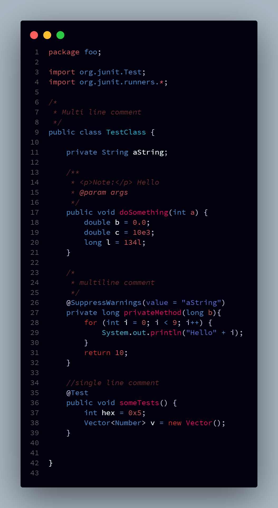
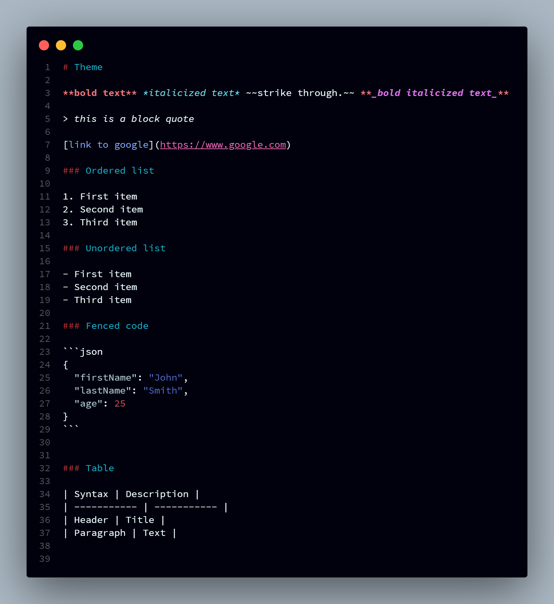

# Nightcall

> _I'm giving you a nightcall to tell you how I feel..._

Nightcall is a dark and deep theme for VSCode inspired by Kavinsky's Nightcall.

[Marketplace](https://marketplace.visualstudio.com/items?itemName=obfuscatedgenerated.nightcall)

[Theme Tester](https://vscode.dev/theme/obfuscatedgenerated.nightcall)

PS: When I made this theme, I wasn't aware of the existence of another theme named Nightcall (by Bobby Patterson). This theme is not related to that one and is very different in the way it looks. Go [check it out](https://marketplace.visualstudio.com/items?itemName=bpat86.nightcall) and compare them!

> _There's something inside you, it's hard to explain..._

## Screenshots

These are subject to change, use the theme tester to see the latest version.

All screenshots use the Source Code Pro font.

### Full Editor

### Individual Features

A unique red color is used for highlighting selected text (with a blue used for duplicate selections):

The terminal has a subtle reddish tint:

### Code Samples

> _They're talking about you boy, but you're still the same..._